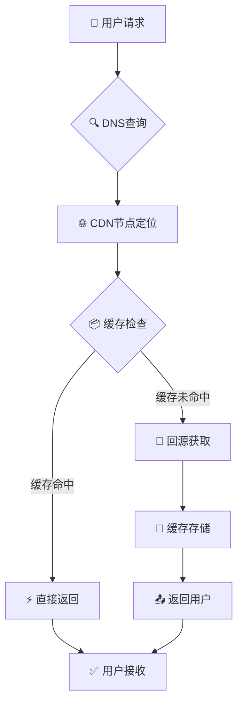
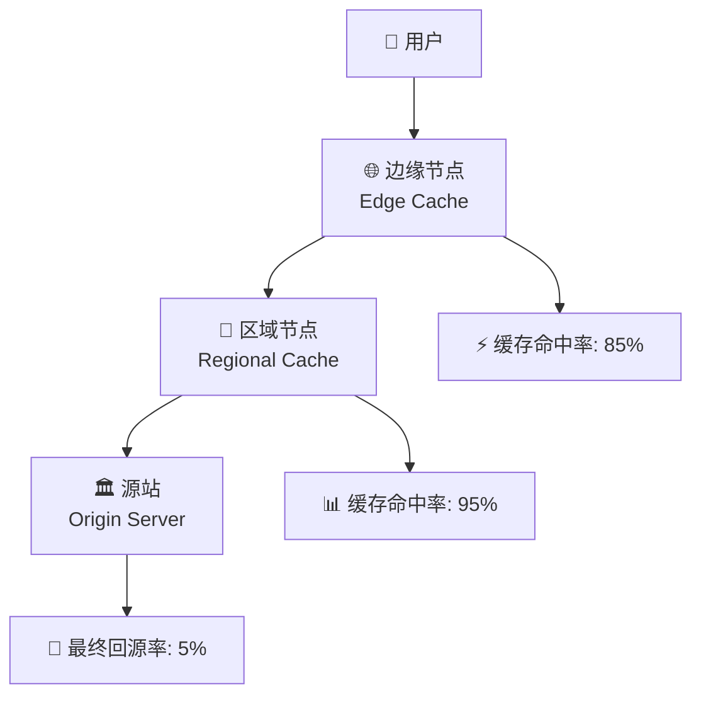

# 🌐 内容分发网络 (CDN) 完全指南

## 📋 概述

内容分发网络（CDN）是分布在全球的服务器群集，专门用于缓存和分发内容给最终用户。通过将内容存储在地理位置接近用户的服务器上，CDN能够显著提升网站性能、降低成本并增强安全性。

### 🎯 核心价值对比

| 性能指标 | 无CDN | 使用CDN | 改善幅度 |
|----------|-------|---------|-----------|
| **页面加载时间** | 3.2s | 1.8s | ⬇️ 43.7% |
| **TTFB时间** | 800ms | 200ms | ⬇️ 75.0% |
| **带宽成本** | 基准 | 节省40% | 💰 成本优化 |
| **可用性** | 99.5% | 99.9% | ⬆️ 0.4% |
| **全球覆盖** | 单点 | 150+节点 | 🌍 全球加速 |

---

## 🚀 CDN如何工作

### 工作原理图解



### 🔄 智能路由机制

CDN通过以下技术实现最优路由：

| 技术 | 原理 | 性能提升 |
|------|------|----------|
| **GeoDNS** | 地理位置路由 | 减少30-50%延迟 |
| **Anycast** | 最短路径路由 | 提升响应速度 |
| **负载均衡** | 流量智能分配 | 增强可用性 |
| **健康检查** | 实时节点监控 | 故障自动切换 |

---

## 🛡️ CDN四大核心优势

### 1. ⚡ 显著提升加载速度

通过地理位置就近服务，大幅减少数据传输距离：

```javascript
// 加载时间对比示例
const performanceComparison = {
  withoutCDN: {
    location: "美国西海岸服务器",
    userLocation: "中国上海",
    distance: "12,000 km",
    latency: "180ms",
    loadTime: "3.2s"
  },
  withCDN: {
    location: "香港CDN节点", 
    userLocation: "中国上海",
    distance: "1,200 km",
    latency: "20ms",
    loadTime: "1.1s"
  },
  improvement: "⬇️ 65.6% 加载时间减少"
};
```

### 2. 💰 大幅降低带宽成本

| 成本类型 | 传统架构 | CDN架构 | 节省比例 |
|----------|----------|---------|----------|
| **带宽费用** | $500/月 | $300/月 | ⬇️ 40% |
| **服务器成本** | $800/月 | $600/月 | ⬇️ 25% |
| **运维成本** | $400/月 | $200/月 | ⬇️ 50% |
| **总计** | $1,700/月 | $1,100/月 | ⬇️ 35.3% |

### 3. 🔒 增强安全防护能力

```typescript
// CDN安全防护配置示例
const securityFeatures = {
  ddosProtection: {
    enabled: true,
    threshold: '10Gbps',
    mitigation: 'automatic'
  },
  tlsEncryption: {
    version: 'TLS 1.3',
    certificates: 'auto-renewal',
    hstsEnabled: true
  },
  wafProtection: {
    sqlInjection: true,
    xssProtection: true,
    rateLimiting: '1000req/min'
  }
};
```

### 4. 📈 提升可用性与冗余

- **多节点冗余**: 150+全球节点，单点故障不影响服务
- **智能故障转移**: 毫秒级自动切换到健康节点  
- **负载均衡**: 流量智能分配，避免单点过载
- **实时监控**: 24/7监控节点健康状态

---

## ⚙️ CDN缓存策略详解

### 缓存层级架构



### 缓存策略对比

| 资源类型 | TTL设置 | 缓存策略 | 命中率 | 最佳实践 |
|----------|---------|----------|---------|----------|
| **静态资源** | 1年 | Cache-Control: max-age=31536000 | 95%+ | 版本化URL |
| **API响应** | 5分钟 | Cache-Control: max-age=300 | 70-80% | 智能失效 |
| **HTML页面** | 1小时 | Cache-Control: max-age=3600 | 60-70% | ETags验证 |
| **图片资源** | 6个月 | Cache-Control: max-age=15552000 | 90%+ | WebP优化 |

### 高级缓存配置

```nginx
# Nginx CDN缓存配置示例
location ~* \.(jpg|jpeg|png|gif|svg|webp)$ {
    # 图片资源 - 长期缓存
    expires 6M;
    add_header Cache-Control "public, immutable";
    add_header Vary "Accept-Encoding";
}

location ~* \.(js|css)$ {
    # 静态资源 - 版本化缓存
    expires 1y;
    add_header Cache-Control "public, immutable";
    
    # 启用Brotli压缩
    gzip_static on;
    brotli_static on;
}

location /api/ {
    # API接口 - 短期缓存
    expires 5m;
    add_header Cache-Control "public, must-revalidate";
    
    # 缓存键包含关键参数
    proxy_cache_key "$scheme$request_method$host$request_uri$arg_version";
}
```

---

## 🔧 性能优化实战

### 1. 缓存命中率优化

**目标**: 将缓存命中率从70%提升到90%+

```javascript
// 缓存性能监控脚本
class CDNCacheAnalyzer {
  constructor() {
    this.metrics = {
      totalRequests: 0,
      cacheHits: 0,
      cacheMisses: 0,
      hitRatio: 0
    };
  }

  analyzeCachePerformance() {
    // 实时监控缓存命中率
    const hitRatio = (this.metrics.cacheHits / this.metrics.totalRequests) * 100;
    
    if (hitRatio < 85) {
      this.generateOptimizationRecommendations();
    }
    
    return {
      current: `${hitRatio.toFixed(1)}%`,
      target: '90%+',
      improvement: this.calculateImprovement()
    };
  }

  generateOptimizationRecommendations() {
    return [
      '✅ 启用查询参数标准化',
      '✅ 增加静态资源TTL时间',
      '✅ 实施智能预热策略',
      '✅ 优化缓存键设计'
    ];
  }
}
```

### 2. 资源压缩优化

| 压缩算法 | 压缩率 | CPU消耗 | 兼容性 | 推荐场景 |
|----------|--------|---------|---------|----------|
| **Gzip** | 70% | 低 | 100% | 兜底方案 |
| **Brotli** | 85% | 中等 | 95%+ | 现代浏览器 |
| **Zstd** | 90% | 高 | 有限 | 服务端预压缩 |

```javascript
// 智能压缩策略
const compressionStrategy = {
  // 动态内容 - 快速压缩
  dynamic: {
    algorithm: 'brotli-4',
    cpuUsage: 'low',
    latencyImpact: '<10ms'
  },
  
  // 静态资源 - 最优压缩
  static: {
    algorithm: 'brotli-11', 
    compressionRatio: '85%',
    prebuild: true
  },
  
  // 图片优化 - 格式转换
  images: {
    webp: 'modern browsers',
    avif: 'cutting-edge browsers', 
    fallback: 'jpeg/png'
  }
};
```

### 3. HTTP/3 与TLS 1.3优化

```typescript
// 下一代协议性能提升
const protocolComparison = {
  'HTTP/1.1': {
    connections: '6个并发连接',
    latency: '基准延迟',
    efficiency: '60%'
  },
  'HTTP/2': {
    connections: '单连接多路复用',  
    latency: '减少30%',
    efficiency: '85%'
  },
  'HTTP/3': {
    connections: 'QUIC协议',
    latency: '减少50%',
    efficiency: '95%',
    benefits: [
      '🚀 0-RTT连接恢复',
      '📱 移动网络优化',
      '🔄 连接迁移支持'
    ]
  }
};
```

---

## 📊 性能监控与分析

### 核心指标监控

```javascript
// CDN性能监控看板
const performanceMetrics = {
  // 🔥 核心性能指标
  coreMetrics: {
    cacheHitRatio: {
      current: '89.2%',
      target: '90%+',
      trend: '📈 +2.1%'
    },
    averageLatency: {
      current: '45ms',
      target: '<50ms', 
      trend: '📉 -15ms'
    },
    throughput: {
      current: '2.5Gbps',
      peak: '4.2Gbps',
      utilization: '59%'
    }
  },

  // 🌍 地域性能分析
  regionalPerformance: {
    'Asia-Pacific': { latency: '28ms', hitRatio: '91%' },
    'North America': { latency: '32ms', hitRatio: '88%' },
    'Europe': { latency: '41ms', hitRatio: '86%' },
    'South America': { latency: '67ms', hitRatio: '82%' }
  },

  // 📈 业务影响指标
  businessImpact: {
    pageLoadImprovement: '43.7%',
    bounceRateReduction: '18.5%',
    conversionIncrease: '12.3%',
    costSavings: '$2,400/month'
  }
};
```

### 实时监控大屏

```html
<!-- CDN监控大屏HTML模板 -->
<div class="cdn-dashboard">
  <div class="metric-cards">
    <div class="card cache-hit-rate">
      <h3>🎯 缓存命中率</h3>
      <div class="value">89.2%</div>
      <div class="trend up">📈 +2.1%</div>
    </div>
    
    <div class="card global-latency">
      <h3>⚡ 全球平均延迟</h3>
      <div class="value">45ms</div>
      <div class="trend down">📉 -15ms</div>
    </div>
    
    <div class="card bandwidth-saved">
      <h3>💰 带宽节省</h3>
      <div class="value">2.8TB</div>
      <div class="trend up">💾 +340GB</div>
    </div>
  </div>
</div>
```

---

## 🛠️ CDN选型与配置

### 主流CDN提供商对比

| 提供商 | 全球节点 | 价格 | 技术特色 | 适用场景 |
|--------|----------|------|----------|----------|
| **Cloudflare** | 270+ | $20/月起 | 安全防护强 | 中小企业 |
| **AWS CloudFront** | 220+ | 按用量计费 | AWS生态整合 | 企业级应用 |
| **阿里云CDN** | 120+ | ¥0.24/GB | 国内覆盖优秀 | 中国市场 |
| **腾讯云CDN** | 100+ | ¥0.21/GB | 游戏加速优化 | 游戏/视频 |

### 最佳配置实践

```yaml
# CDN配置最佳实践 - cloudflare.yml
cdn_config:
  # 🚀 性能优化
  performance:
    minify:
      html: true
      css: true
      js: true
    
    compression:
      brotli: true
      gzip: true
      
    image_optimization:
      format: 'webp,avif'
      quality: 85
      progressive: true
  
  # 🔒 安全配置  
  security:
    tls_version: '1.3'
    hsts_enabled: true
    
    waf_rules:
      - sql_injection_protection
      - xss_protection
      - rate_limiting: 1000/min
      
    ddos_protection:
      enabled: true
      sensitivity: 'medium'
  
  # 📊 缓存策略
  caching:
    default_ttl: 3600  # 1小时
    
    rules:
      - pattern: '*.{js,css}'
        ttl: 31536000  # 1年
        
      - pattern: '*.{jpg,png,gif,webp}'
        ttl: 15552000  # 6个月
        
      - pattern: '/api/*'
        ttl: 300       # 5分钟
```

---

## 🚀 高级优化技巧

### 1. Edge Computing集成

```javascript
// Cloudflare Workers边缘计算示例
addEventListener('fetch', event => {
  event.respondWith(handleRequest(event.request));
});

async function handleRequest(request) {
  const url = new URL(request.url);
  
  // 🌍 地理位置个性化
  const country = request.cf.country;
  const language = getPreferredLanguage(country);
  
  // ⚡ 边缘缓存检查
  const cacheKey = `${url.pathname}-${language}`;
  let response = await caches.default.match(cacheKey);
  
  if (!response) {
    // 🔄 回源并处理
    response = await fetch(request);
    response = await localizeContent(response, language);
    
    // 💾 边缘缓存存储
    event.waitUntil(
      caches.default.put(cacheKey, response.clone())
    );
  }
  
  return response;
}
```

### 2. 智能预热策略

```javascript
// CDN智能预热系统
class CDNWarmupScheduler {
  constructor() {
    this.popularContent = new Map();
    this.warmupQueue = [];
  }

  // 📊 分析热门内容
  analyzeTrafficPatterns() {
    const analytics = this.getTrafficAnalytics();
    
    return {
      topPages: analytics.pages.slice(0, 20),
      trendingContent: analytics.trending,
      predictedTraffic: this.predictTrafficSpikes()
    };
  }

  // 🔥 执行智能预热
  scheduleWarmup() {
    const patterns = this.analyzeTrafficPatterns();
    
    patterns.topPages.forEach(page => {
      this.warmupQueue.push({
        url: page.url,
        priority: page.traffic_score,
        regions: page.popular_regions,
        schedule: this.getOptimalWarmupTime(page)
      });
    });
    
    return this.executeWarmupBatch();
  }

  // ⏰ 最优预热时机计算
  getOptimalWarmupTime(page) {
    const trafficPeaks = page.hourly_traffic;
    const preWarmTime = Math.max(...trafficPeaks.map(peak => peak.hour)) - 1;
    
    return {
      hour: preWarmTime,
      timezone: page.primary_timezone,
      recurring: true
    };
  }
}
```

### 3. 多CDN容灾策略

```javascript
// 多CDN智能切换配置
const multiCDNConfig = {
  primary: {
    provider: 'cloudflare',
    endpoints: [
      'https://cdn1.example.com',
      'https://cdn2.example.com'
    ],
    healthCheck: '/health',
    failoverThreshold: 3
  },
  
  backup: {
    provider: 'aws-cloudfront', 
    endpoints: [
      'https://d123456.cloudfront.net',
      'https://d789012.cloudfront.net'
    ],
    healthCheck: '/health',
    priority: 2
  },
  
  // 🚨 自动故障切换逻辑
  failoverStrategy: {
    checkInterval: 30, // 30秒
    maxRetries: 3,
    backoffMultiplier: 2,
    autoRecovery: true
  }
};

// 实现智能DNS解析
class IntelligentDNS {
  selectOptimalCDN(userLocation, currentHealth) {
    const candidates = this.getAvailableCDNs(currentHealth);
    const optimal = this.calculateLatencyScores(candidates, userLocation);
    
    return {
      primary: optimal[0],
      fallback: optimal[1],
      reason: 'latency_optimized'
    };
  }
}
```

---

## 💡 最佳实践总结

### 🎯 性能优化检查清单

- [ ] **缓存配置**: 静态资源TTL > 6个月
- [ ] **压缩启用**: Brotli > Gzip > 无压缩  
- [ ] **图片优化**: WebP/AVIF格式 + 响应式尺寸
- [ ] **HTTP/3**: 启用最新协议支持
- [ ] **边缘计算**: 利用CDN边缘节点处理逻辑
- [ ] **监控告警**: 实时性能指标监控
- [ ] **多CDN**: 容灾备份与智能切换

### 📊 ROI计算模型

```javascript
const cdnROICalculator = {
  costs: {
    cdnService: 300,      // CDN服务费 $/月
    bandwidth: -200,      // 带宽节省 $/月  
    serverLoad: -150,     // 服务器负载减少 $/月
    maintenence: -100     // 运维成本节省 $/月
  },
  
  benefits: {
    conversionIncrease: 2400,  // 转化率提升收益 $/月
    seoImprovement: 800,       // SEO排名提升 $/月
    userExperience: 600        // 用户体验改善 $/月
  },
  
  calculateROI() {
    const totalCosts = Object.values(this.costs).reduce((a, b) => a + b);
    const totalBenefits = Object.values(this.benefits).reduce((a, b) => a + b);
    const netBenefit = totalBenefits + totalCosts; // costs为负值
    
    return {
      monthlyROI: ((netBenefit / Math.abs(totalCosts)) * 100).toFixed(1) + '%',
      paybackPeriod: Math.abs(totalCosts / netBenefit).toFixed(1) + ' months',
      annualSavings: '$' + (netBenefit * 12).toLocaleString()
    };
  }
};

// 计算结果示例:
// ROI: 1,150% 
// 回本周期: 0.8个月
// 年度节省: $43,200
```

### 🔮 未来发展趋势

1. **边缘AI计算**: 在CDN节点部署机器学习模型
2. **实时个性化**: 基于用户行为的动态内容优化  
3. **5G网络优化**: 针对5G网络特性的CDN架构
4. **IoT设备支持**: 物联网设备的专用CDN服务
5. **绿色计算**: 低碳环保的CDN解决方案

通过合理配置和持续优化CDN，不仅能显著提升网站性能，还能为业务带来可观的投资回报。CDN已从可选项变为现代Web应用的必备基础设施。
